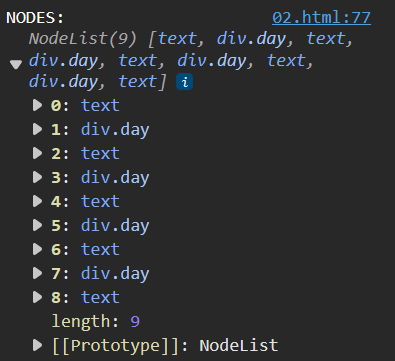

## Document Object Model

<!-- In Browser's console -->
console.log(window); <!-- To see all window object properties -->
console.log(window.document); <!-- You don't need to write window each time -->
console.log(document); <!-- You get Html document -->
console.dir(document); <!-- To get all document properties -->

console.log(document.links); <!-- You will get html collection of all links in that page -->
<!-- HTML collection, node collection, Arrays are different things so array properties will not work here -->

- `getElementById`: `document.getElementById('id')`
    It will return the element with that specific id.
- `.className`: To get class of that element
- `.getAttribute('attrName')`: To get attribute value of that element
- `.setAttribute('attrName', 'attrValue)`: To set attribute value of that element
- `.style.styleProperty`: To apply style. Ex - `.style.backgroundColor = '#000000'`

- `textContent` VS `innerHTML` VS `innerText`
    - `innerText`: you will get inner text of element
    - `innerHTML`: you will get inner text and HTML of element
    - `textContent`: You will get all inner text along with hidden text which is hidden by any css property.

- `querySelector(element)`: you will get first html of that element.
    - `querySelector('input[type="password"]')`
    - `querySelector('p:first-child'`

- `querySelectorAll('element')`: It will give you all elements
    - You will get NodeList in return. It's like an array but not array.
    - As it returns all values, if you want to change any element you need to pick it by using element[index]. same as array. 
    Example: `tempList[0].style.color = 'green'`
    - On that NodeList you can able to apply forEach loop also.

- `getElementsByClassName('classname')`: You will get HTML collection in return.
    - On HTMLCollection you can't able to apply forEach loop
    - So convert this HTMLCollection into Array by using `Array.from(htmlcollectionname)`

relations in DOM
- childNodes Example: 
    