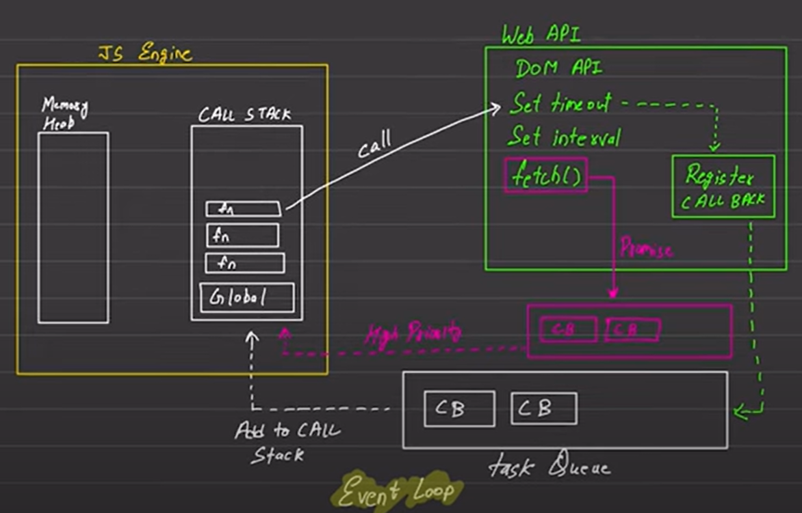

# ASYNC

## JavaScript
- Synchronous language: Code execute sequentially
- Single threaded: All will execute in one thread only.

## Execution Context
- Execute one line of code at a time.
- Each operation waits for last one to complete before executing.

## Synchronous and Asynchronous code
- Blocking code: You can't able to another task while current task is not active until it's end completely.
- Non-blocking code: It works continuously until some data is come later.

- Blocking and Non-blocking code both are important. In case of DB registration you've to use blocking code otherwise while registering if an error happens then it's wrong to show message "successful'

## Event Loop
- In execution environments such as browsers, nodejs etc. they don't have only JS engine (because, it's single threaded). They use engines like v8 which is written in c++.
- web API will always found in browsers. Or sometimes environments are given such as node. If node environment is given then DOM API will not be given.
- Task queue makes JS fast and Asynchronous.

    