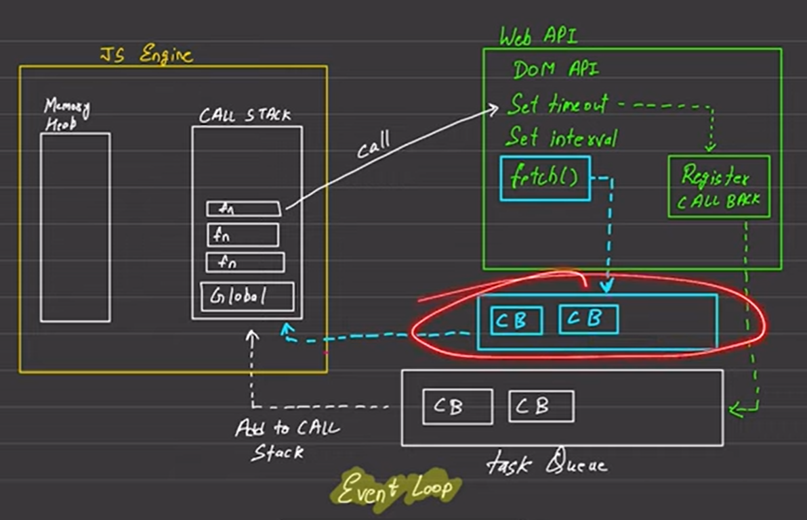
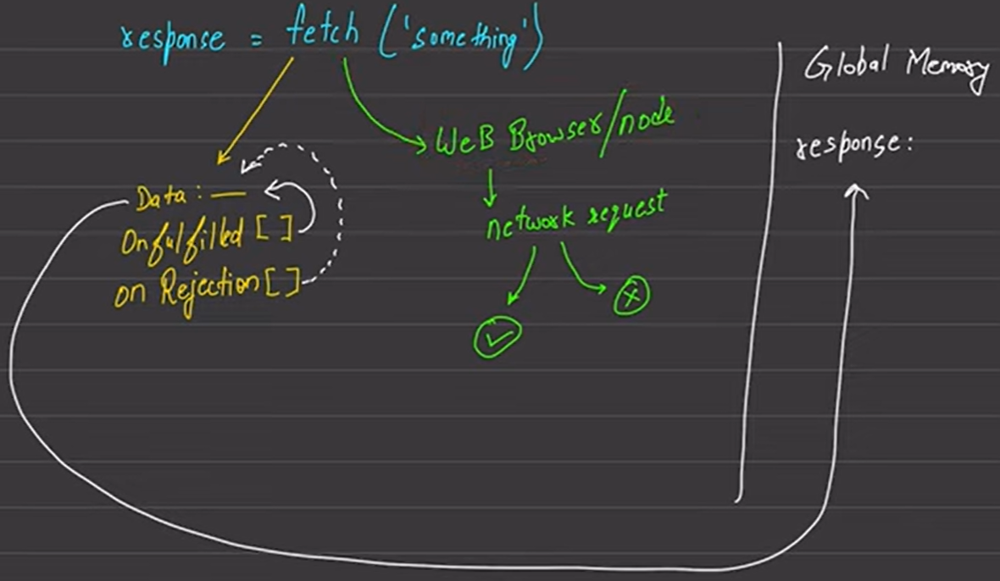

# Promise

The Promise object represents the eventual completion (or failure) of an asynchronous operation and its resulting value.
It means given task will not complete immediately and when will it complete or return is not known.

- Promise has 3 states:
    - Pending
    - Fullfilled
    - rejected

- Maximum times you will consume promise not create. It's by using fetch.

## Fetch

- Fetch was available in browsers but in 2022 it was included in node js as well.
- NodeJS wrote own stream APIs to include fetch in nodeJS
- It fetches the resource from a network and returns a promise which is fulfilled once the response is available.

    
 

- queue (which is colored in blue) is a special queue created only for fetch.
- It's a microtask queue/ priority queue/ fetch queue.
- Any work which is from fetch is comes in a call back.
- Priority of fetch queue is high than task queue.
- So that this queue's task are add first in stack.

    

- When fetch is called then it's one part is goes to handle browser's/node's api requests and other for variables to space reserve in memory.
- Onfulfilled[] is promise's resolve
- onRejection[] is promise's reject. We can't able to access it directly.

- Error 404 is count in onFulfilled. Because request goes in network therefore you no that it's 404 error.

- Data reversed in memory. It's initial value is empty.
- In onfulfilled and onRejected you get functions which are responsible for data fulfilment. After data is fulfilled it goes to response.