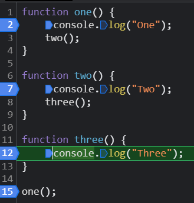

# Javascript---Chai-aur-Code
Learning JavaScript from YouTube tutorial by Chai or Code.

## Javascript Execution Context
- It means how JS will run code file.
- JS runs the file in 2 phases.
- Whenever you give code file to JS then it first makes a global execution context. And it's refered by this.
- In browsers value of `this` is window object.
- JavaScript is a single threaded language.
- Function Execution Context
- Eval Execution Context (it's in mongoose)
- 2 phases:
    1. Memory **Creation Phase**: It allocates memory for variables.
    2. Execution Phase: It executes the functions.
- Understand using diagram:
    

    - Step 1: Code is run by Global Execution and allocate in `this`
    - Step 2: Memory Phase - All variables (initial value `undefined`) and function definations are stored.
    - Step 3: Execution Phase - Actual values of variables moved to variables. It will ignore functions in between. When it reach to call of function then it will create new variable and execution environement for that function. Then it will repeate memory and execution phase. After that it will return value to global execution context.
    After executing the function, it deletes the executional context created for that function.

- Call Stack:
    

    You can see call stack in inspect of browser in code snippet.
    
    